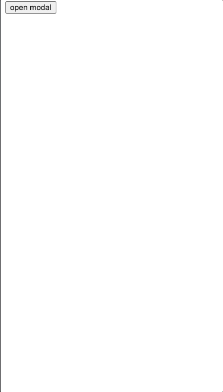

# MODAL (react modal)

  [](https://badge.fury.io/js/@dev.waca%2Fmodal) 

---



`react` 에서 사용 하려고 만든 `modal` 라이브러리

## 설치 ( Installation )

```bash
npm i @dev.waca/modal
# OR ( use yarn )
yarn add @dev.waca/modal
# OR ( use pnpm )
pnpm i @dev.waca/modal
```

## 사용 ( Usage )

```tsx
import modal, { ModalContainer, ModalRoot } from "@dev.waca/modal";
import "@dev.waca/modal/dist/style.css";

const Modal: ModalRoot = ({ id }) => {
  return (
    <div>
      <p>React Modal</p>
      <button onClick={() => modal.close(id)}>close modal</button>
    </div>
  );
};

const InformationModal: ModalRoot<{ message: string }> = ({ id, message }) => {
  return (
    <div>
      <p>{message}</p>
      <button onClick={() => modal.close(id)}>close modal</button>
    </div>
  );
};

function App() {
  const onModalOpenClick = () => {
    modal.open(Modal);
  };

  const onInformationModalOpenClick = () => {
    // return modal id
    const modalId = modal.open(InformationModal, {
      // custom id props
      id: "information-modal" // optional
      props: {
        message: "React Modal"
      },
      backgroundCloseable: true, // default false
      onOpen: () => { console.log("open modal event") }, // optional
      onClose: () => { console.log("close modal event") } // optional
    })
  }

  return (
    <div>
      <div>
        <button onClick={onModalOpenClick}>open modal</button>
      </div>
      <div>
        <button onClick={onInformationModalOpenClick}>open information modal</button>
      </div>
      <ModalContainer />
    </div>
  );
}

export default App;
```

## Feature

- 화면 중앙이 아닌 지정된 위치에 사용할 수 있도록 추가 예정
- 여러 `ModalContainer` 지원 기능
